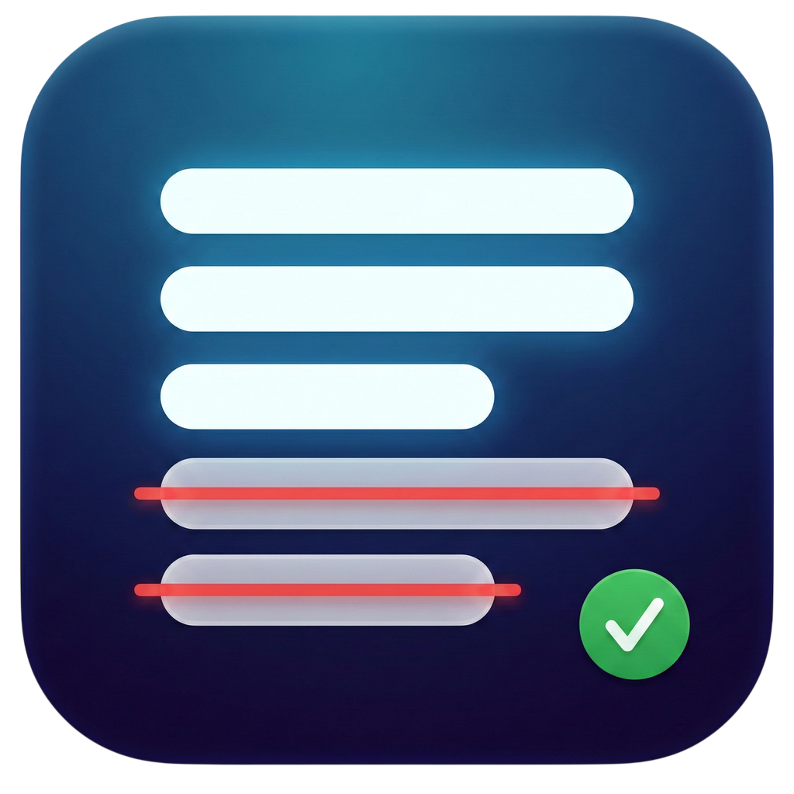

<p align="center">
  
</p>

<h1 align="center">Delyrics - 가사 중복 제거기</h1>

<p align="center">
  <a href="https://github.com/chanwoo7/delyrics/releases/latest"></a>
  <a href="https://github.com/chanwoo7/delyrics/releases"></a>
  
  
</p>

<p align="center"><a href="README.md">English</a> | 한국어</p>

<p align="center">가사 텍스트를 줄 단위로 중복 제거해주는 간단한 macOS 전용 데스크톱 앱입니다.</p>

<p align="center">여러 줄의 가사를 붙여넣으면, 각 줄을 위에서부터 순서대로 검사하여<br>이미 등장한 내용과 중복되는 줄은 제거하고, 최초 등장한 줄만 유지한 결과를 출력합니다.</p>

## 실행 방법

```bash
flutter run -d macos
```

## macOS 빌드 방법

```bash
flutter build macos
```

빌드된 앱은 `build/macos/Build/Products/Release/` 디렉토리에 생성됩니다.

## 사용 방법

1. 입력 영역에 가사를 붙여넣습니다.
2. **변환** 버튼을 클릭하거나 `⌘ + Enter`를 누릅니다.
3. 하단 출력 영역에 중복이 제거된 결과가 표시됩니다.
4. **결과 복사** 버튼으로 클립보드에 복사할 수 있습니다.
5. **초기화** 버튼으로 입력/출력을 모두 비울 수 있습니다.

## 단축키

| 단축키 | 동작 |
|--------|------|
| `⌘ + Enter` | 중복 제거 변환 실행 |
| `Enter` | 줄바꿈 (변환 아님) |

## 중복 판정 규칙

두 줄은 **모든 공백 문자(스페이스, 탭, 앞뒤 공백 등)를 제거했을 때** 문자열이 같으면 중복으로 간주합니다.

예시: 아래 두 줄은 중복으로 판정됩니다.
```
오직 내 삶에 오직 내 맘에 그가 주인 되셨네
오직 내삶에 오직 내 맘에 그가 주인되셨네
```

출력 시에는 첫 등장한 줄의 원문(앞뒤 공백만 제거)을 그대로 유지합니다.

## 주요 기능

- 공백 정규화 기반 줄 단위 중복 제거
- 다크 / 라이트 / 시스템 테마 모드
- 영어 / 한국어 / 시스템 언어 지원
- `⌘ + Enter` 단축키로 빠른 변환
- 원클릭 클립보드 복사

## 기술 스택

- Flutter (Desktop) / Dart
- macOS 전용

## 테스트

```bash
flutter test
```
